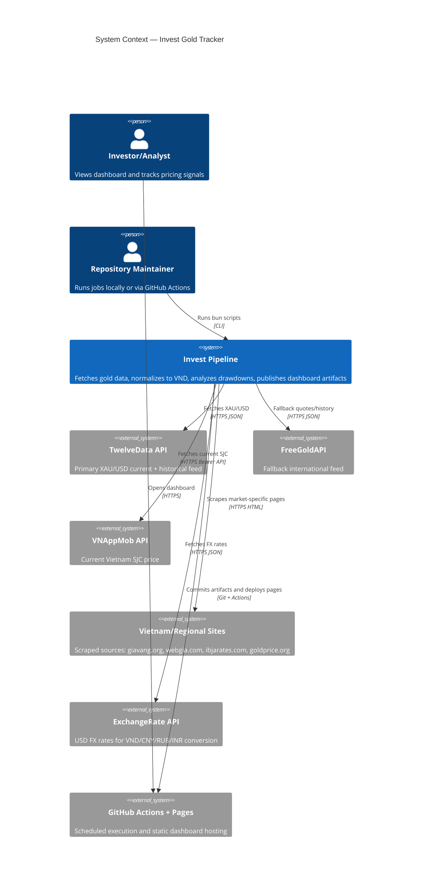
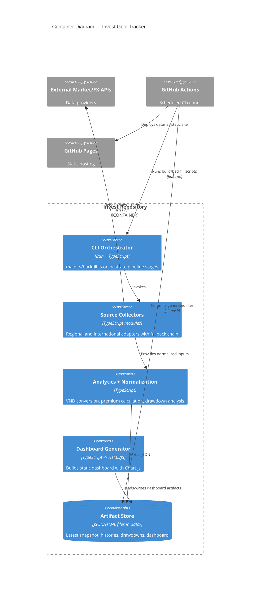
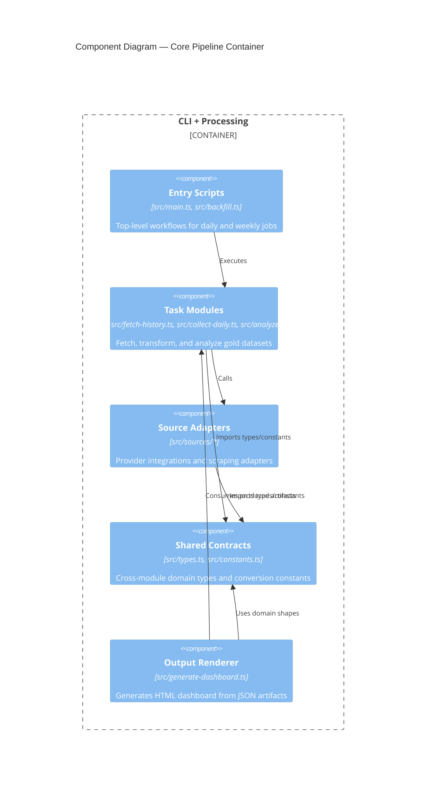

# C4 Architecture

## Context Diagram

```mermaid
C4Context
    title System Context — Invest Gold Tracker
    Person(investor, "Investor/Analyst", "Views dashboard and tracks pricing signals")
    Person(maintainer, "Repository Maintainer", "Runs jobs locally or via GitHub Actions")
    System(system, "Invest Pipeline", "Fetches gold data, normalizes to VND, analyzes drawdowns, publishes dashboard artifacts")
    System_Ext(twelve, "TwelveData API", "Primary XAU/USD current + historical feed")
    System_Ext(freegold, "FreeGoldAPI", "Fallback international feed")
    System_Ext(vnappmob, "VNAppMob API", "Current Vietnam SJC price")
    System_Ext(vietsites, "Vietnam/Regional Sites", "Scraped sources: giavang.org, webgia.com, ibjarates.com, goldprice.org")
    System_Ext(fx, "ExchangeRate API", "USD FX rates for VND/CNY/RUB/INR conversion")
    System_Ext(github, "GitHub Actions + Pages", "Scheduled execution and static dashboard hosting")

    Rel(investor, github, "Opens dashboard", "HTTPS")
    Rel(maintainer, system, "Runs bun scripts", "CLI")
    Rel(system, twelve, "Fetches XAU/USD", "HTTPS JSON")
    Rel(system, freegold, "Fallback quotes/history", "HTTPS JSON")
    Rel(system, vnappmob, "Fetches current SJC", "HTTPS Bearer API")
    Rel(system, vietsites, "Scrapes market-specific pages", "HTTPS HTML")
    Rel(system, fx, "Fetches FX rates", "HTTPS JSON")
    Rel(system, github, "Commits artifacts and deploys pages", "Git + Actions")
```

## Container Diagram

```mermaid
C4Container
    title Container Diagram — Invest Gold Tracker
    Container_Boundary(invest, "Invest Repository") {
        Container(orchestrator, "CLI Orchestrator", "Bun + TypeScript", "main.ts/backfill.ts orchestrate pipeline stages")
        Container(collectors, "Source Collectors", "TypeScript modules", "Regional and international adapters with fallback chain")
        Container(processing, "Analytics + Normalization", "TypeScript", "VND conversion, premium calculation, drawdown analysis")
        Container(renderer, "Dashboard Generator", "TypeScript -> HTML/JS", "Builds static dashboard with Chart.js")
        ContainerDb(artifacts, "Artifact Store", "JSON/HTML files in data/", "Latest snapshot, histories, drawdowns, dashboard")
    }
    System_Ext(externalApis, "External Market/FX APIs", "Data providers")
    System_Ext(gha, "GitHub Actions", "Scheduled CI runner")
    System_Ext(pages, "GitHub Pages", "Static hosting")

    Rel(gha, orchestrator, "Runs build/backfill scripts", "bun run")
    Rel(orchestrator, collectors, "Invokes")
    Rel(collectors, externalApis, "Reads prices + rates", "HTTPS")
    Rel(collectors, processing, "Provides normalized inputs")
    Rel(processing, artifacts, "Writes JSON")
    Rel(renderer, artifacts, "Reads/writes dashboard artifacts")
    Rel(gha, artifacts, "Commits generated files", "git push")
    Rel(gha, pages, "Deploys data/ as static site")
```

## Component Diagram

```mermaid
C4Component
    title Component Diagram — Core Pipeline Container
    Container_Boundary(core, "CLI + Processing") {
        Component(entry, "Entry Scripts", "src/main.ts, src/backfill.ts", "Top-level workflows for daily and weekly jobs")
        Component(tasks, "Task Modules", "src/fetch-all.ts, src/fetch-history.ts, src/collect-daily.ts, src/analyze-drawdowns.ts", "Fetch, transform, and analyze gold datasets")
        Component(adapters, "Source Adapters", "src/sources/*", "Provider integrations and scraping adapters")
        Component(shared, "Shared Contracts", "src/types.ts, src/constants.ts", "Cross-module domain types and conversion constants")
        Component(output, "Output Renderer", "src/generate-dashboard.ts", "Generates HTML dashboard from JSON artifacts")
    }

    Rel(entry, tasks, "Executes")
    Rel(tasks, adapters, "Calls")
    Rel(tasks, shared, "Imports types/constants")
    Rel(adapters, shared, "Imports types/constants")
    Rel(output, tasks, "Consumes produced artifacts")
    Rel(output, shared, "Uses domain shapes")
```
