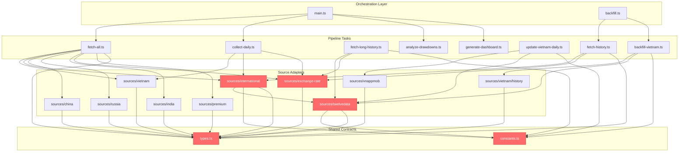

# Dependency Graph

## Module Dependencies

## Hub Analysis

| File | Dependents | Recent Changes (6mo) | Stability | Risk |
|------|-----------|---------------------|-----------|------|
| `src/types.ts` | 12 direct | 2 commits | Stable | High |
| `src/constants.ts` | 5 direct | 2 commits | Stable | Medium |

No other file reached the 5+ dependent threshold; near-hubs include `src/sources/exchange-rate/index.ts` and `src/sources/twelvedata/index.ts` (4 dependents each).

## Layer Violations

No layer violations detected under the current layering model (orchestration -> tasks -> sources/shared).

## Blast Radius

### `src/types.ts`
- Direct: 12 files (`src/fetch-all.ts`, `src/fetch-history.ts`, and most source adapters).
- Indirect: 4 additional files (`src/backfill-vietnam.ts`, `src/collect-daily.ts`, `src/fetch-long-history.ts`, `src/update-vietnam-daily.ts`) through adapter imports.
- Risk: Shape changes to `GoldPrice`, `FetchResult`, or `HistoricalPrice` can break most collectors and aggregation code.
- Recommendation: Make additive changes first, keep temporary compatibility fields, and run all pipeline scripts after any type refactor.

### `src/constants.ts`
- Direct: 5 files (`src/backfill-vietnam.ts`, `src/fetch-long-history.ts`, `src/sources/international/index.ts`, `src/sources/twelvedata/index.ts`, `src/update-vietnam-daily.ts`).
- Indirect: 3 files (`src/collect-daily.ts`, `src/fetch-all.ts`, `src/fetch-history.ts`) via imported source modules.
- Risk: Conversion constants directly affect premium and normalization calculations.
- Recommendation: Treat as domain constants; add explicit regression checks around tael/ounce conversions before modification.
