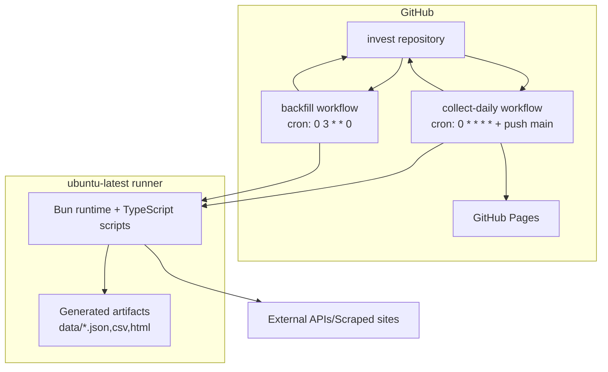

# Infrastructure

## Deployment Diagram

## Services

| Service | Technology | Port | Dependencies |
|---------|-----------|------|-------------|
| Daily pipeline runner | GitHub Actions + Bun | N/A (batch job) | TwelveData, VNAppMob, FreeGoldAPI, exchangerate-api, scraped market websites, git push permissions |
| Weekly backfill runner | GitHub Actions + Bun | N/A (batch job) | TwelveData, webgia.com, git push permissions |
| Dashboard hosting | GitHub Pages static site | HTTPS/443 (managed) | `data/dashboard.html` and related artifacts uploaded by workflow |

## CI/CD Pipeline

### Pipeline: Collect Gold Prices (`.github/workflows/collect-daily.yml`)

**Trigger**: push to `main`, hourly cron `0 * * * *`, manual `workflow_dispatch`
**Stages**:
1. Checkout + Bun setup + dependency install (`actions/checkout`, `oven-sh/setup-bun`, `bun install`)
2. Build dashboard pipeline (`bun run build`) with `TWELVEDATA_API_KEY` and `VNAPPMOB_API_KEY`
3. Commit generated JSON artifacts to repository (`git add data/*.json`, commit/pull --rebase/push)
4. Deploy static artifacts to GitHub Pages (`configure-pages`, `upload-pages-artifact`, `deploy-pages`)

### Pipeline: Weekly Backfill (`.github/workflows/backfill.yml`)

**Trigger**: weekly cron `0 3 * * 0`, manual `workflow_dispatch`
**Stages**:
1. Checkout + Bun setup + dependency install
2. Run backfill command (`bun run backfill`) with `TWELVEDATA_API_KEY`
3. Commit any changed artifacts (`git add -A`, conditional commit, pull --rebase, push)

## Environment Configuration

| Variable | Required | Description | Example |
|----------|----------|-------------|---------|
| `TWELVEDATA_API_KEY` | Yes (for primary international feed) | Auth key for TwelveData current and historical XAU/USD calls | `td_xxx` |
| `VNAPPMOB_API_KEY` | Required for VNAppMob path | Bearer token for current Vietnam SJC API | `vna_xxx` |
| `GOLDAPI_KEY` | Optional | Last-resort fallback provider for international price | `goldapi_xxx` |
| `METALS_DEV_KEY` | Optional | India adapter fallback source | `metals_xxx` |
| `HISTORICAL_EXCHANGE_RATE` | Optional | Override fixed historical USD/VND conversion during Vietnam backfill/update | `25500` |

## Cloud Services

| Provider | Service | Used For | Configuration |
|----------|---------|----------|--------------|
| GitHub | GitHub Actions | Scheduled CI and data-generation jobs | `.github/workflows/*.yml` |
| GitHub | GitHub Pages | Static hosting of generated dashboard artifacts | `actions/deploy-pages@v4` |
| Third-party APIs | Market/FX data APIs | Runtime data collection | Hardcoded endpoints + env API keys in `src/sources/*` |
