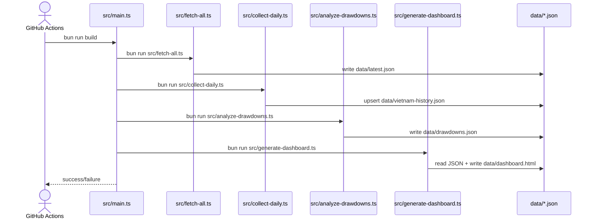
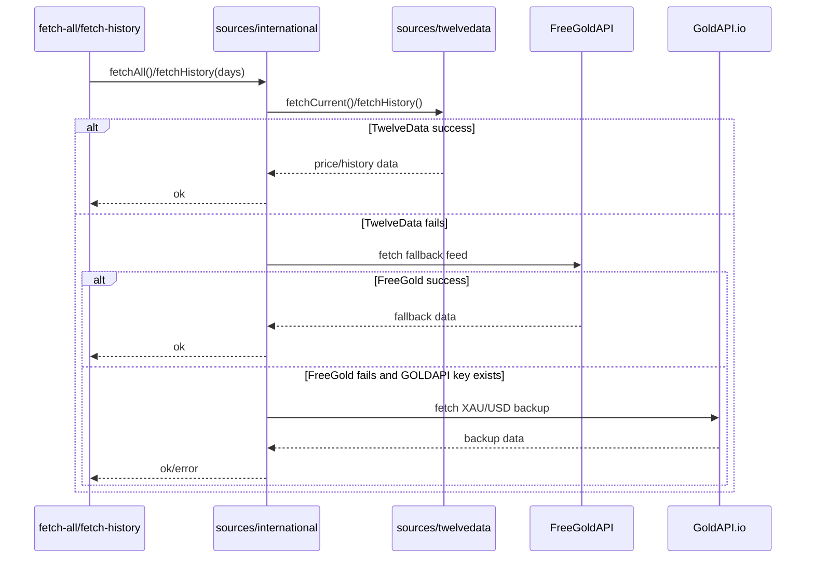
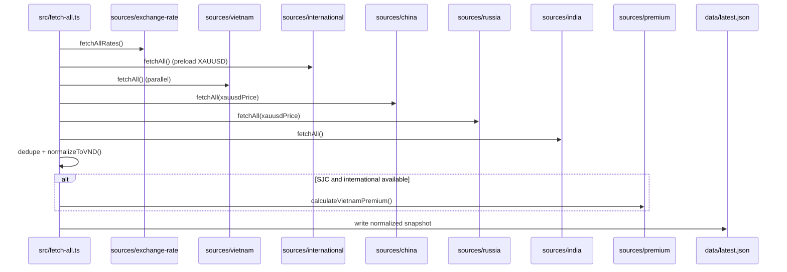
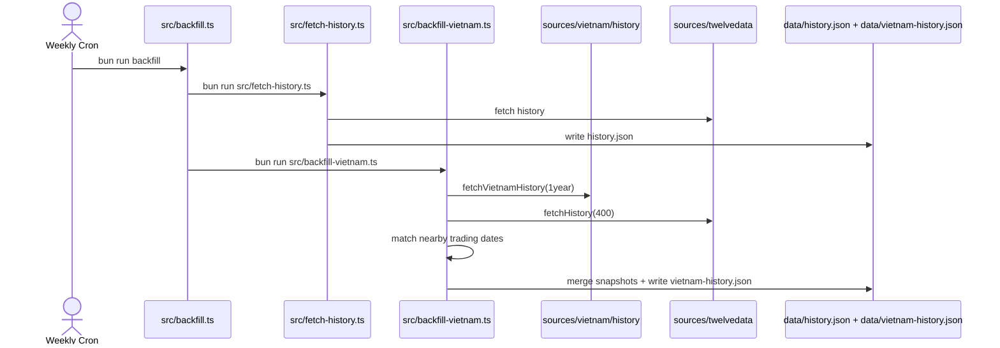

# Key Flows

## Daily Build and Publish

Triggered by `bun run build` (manually or `.github/workflows/collect-daily.yml`) to refresh all outputs and publish the dashboard.

## International Price Resolution with Fallbacks

Triggered by `fetch-all` and history commands; resolves XAU/USD using primary API then fallbacks.

## Regional Aggregation and VND Normalization

Triggered by `src/fetch-all.ts`; concurrently pulls multi-country prices and converts all values to VND.

## Weekly Historical Backfill

Triggered by `.github/workflows/backfill.yml`; updates long-running historical datasets.

