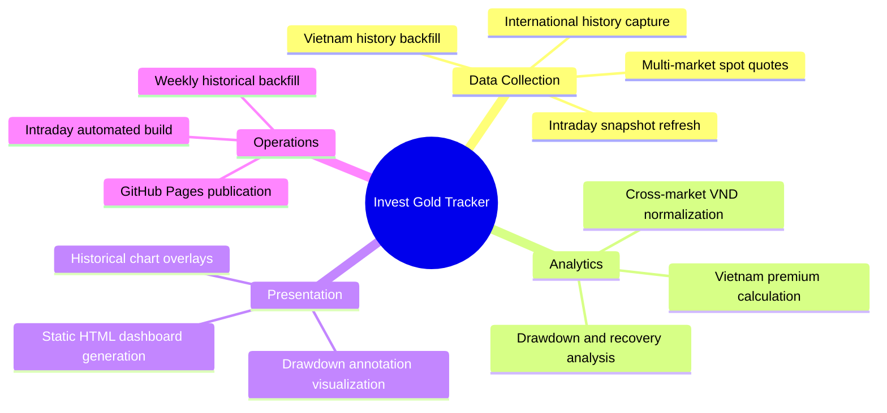

# Product Requirements

## Feature Map

## User Roles

| Role | Description | Key Capabilities |
|------|-------------|-----------------|
| Investor/Analyst | Consumer of generated insights and dashboard | View normalized prices, compare premiums, inspect long-history and drawdown metrics |
| Maintainer/Operator | Developer or repo owner running automation | Execute CLI commands, tune env keys/rates, inspect and publish generated artifacts |

## Features

### Market Data Aggregation

- **Multi-source international feed**: Pull XAU/USD from TwelveData with automated fallback chain.
- **Regional price adapters**: Collect Vietnam, China, Russia, and India prices from APIs/scraping sources.
- **FX normalization**: Convert all regional prices to VND for direct comparison.

### Historical Intelligence

- **International history export**: Produce configurable day/year history JSON datasets.
- **Vietnam history merging**: Align webgia SJC history against international trading days using nearby-date matching.
- **Timeline freshness**: Upsert current-day snapshots to keep Vietnam history current during intraday runs.

### Decision Support Analytics

- **Premium tracking**: Compute Vietnam SJC premium versus international benchmark.
- **Drawdown analytics**: Detect peak-to-trough declines and recovery durations.
- **Trend statistics**: Compute volatility, moving averages, long-range percentile and min/max context.

### Dashboard Delivery

- **Static dashboard build**: Render `data/dashboard.html` from generated artifacts.
- **Interactive chart controls**: Time-range toggles and indicator overlays (MA/Bollinger/optional SJC line).
- **Automated publishing**: Push artifacts and deploy GitHub Pages on an hourly schedule.

## Business Rules

- Price conversion constants are fixed (`1 oz = 31.1035g`, `1 tael = 37.5g`) and used throughout normalization.
- Vietnam premium formula is encoded as `(local_sjc - international_tael_vnd) / international_tael_vnd * 100`.
- `collect-daily` upserts the current day entry (replace existing snapshot for the same date).
- Historical backfill uses a +/-3 day nearest-match rule to align Vietnam weekend entries with international trading data.
- Backfill and daily update default to `DEFAULT_HISTORICAL_EXCHANGE_RATE` (25500) unless `HISTORICAL_EXCHANGE_RATE` override is provided.
- Drawdown detection only records events above a configurable threshold (default 10%) and reports recovery status.
